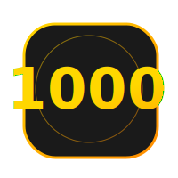

<p align="center">
  
</p>

# 📦 Вгадай число (1-1000)
> Проєкт «Guess the Number» з двома інтерфейсами: консольним та сучасним вебом.

## 🚀 Про проєкт
Ця програма реалізує захопливу гру, де комп'ютер вгадує загадане вами число в діапазоні від **1 до 1000**. Завдяки алгоритму **бінарного пошуку**, ваше число гарантовано буде знайдено за **10 або менше** запитань.

---

## 🎮 Варіанти гри

### 1. 🖥️ Консольна версія (C#)
Класична реалізація для терміналу з підтримкою української мови, кольоровим виводом та повною підтримкою UTF-8.

**Як запустити:**
1. Впевніться, що у вас встановлено **.NET SDK** (версії 6.0+).
2. Відкрийте термінал у папці проєкту.
3. Виконайте команду:
   ```bash
   dotnet run
   ```

### 2. 🌐 Візуальна версія (Web)
Сучасний веб-інтерфейс з ефектом **скломорфізму (Glassmorphism)**, плавними анімаціями та інтерактивним прогрес-баром.

**Як запустити:**
- Просто відкрийте файл [index.html](file:///Users/dee7even/1-1000/view/index.html) у будь-якому сучасному браузері.

---

## 📜 Правила гри
1. Загадайте число від **1 до 1000**.
2. Відповідайте на запитання програми: «Чи ваше число БІЛЬШЕ ніж X?»
   - **ТАК**: якщо ваше число > X.
   - **НІ**: якщо ваше число ≤ X (або дорівнює йому).
3. Комп'ютер має обмежену кількість спроб (10), щоб дізнатися вашу таємницю.

## 💰 Система нагород та штрафів
- 🏆 **Перемога (≤ 10 спроб):** Ви отримуєте кубок чемпіона та премію **1000$**.
- 💸 **Програш (> 10 спроб):** На розробника комп'ютера накладається штраф у розмірі **500$**.

---

## 🛠️ Технології
- **Backend:** [C# / .NET 8](file:///Users/dee7even/1-1000/Program.cs)
- **Frontend:** [HTML5, CSS3, JavaScript](file:///Users/dee7even/1-1000/view/index.html)
- **Алгоритм:** Binary Search ($O(\log n)$)

---
*University Quest Project 2026*

